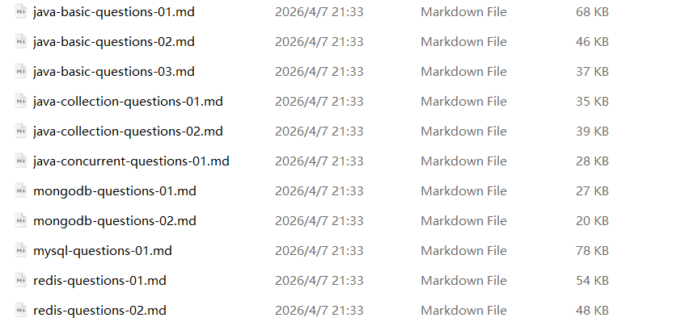
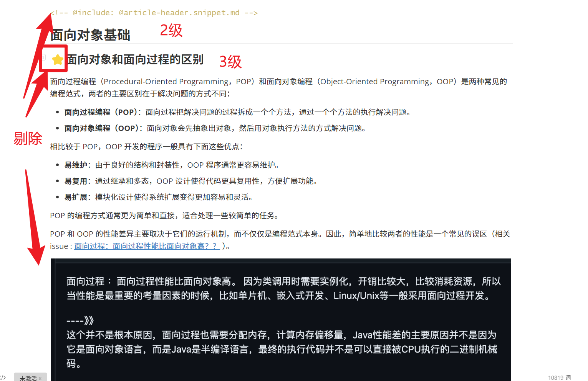
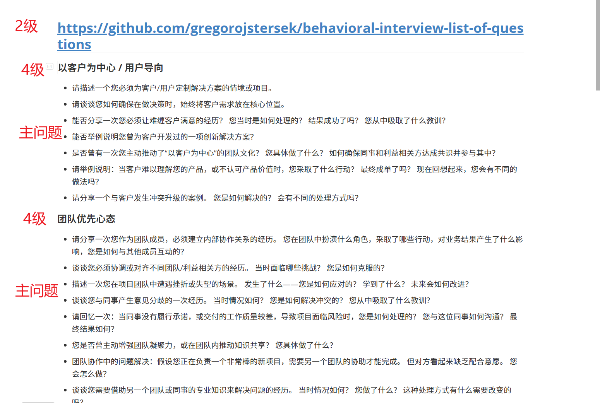
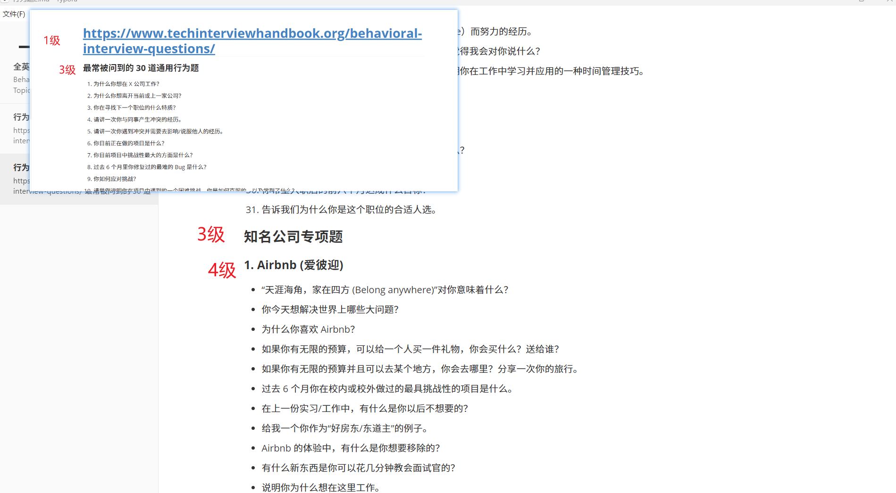

井老师好！我是2548闫楷麒，这部分是介绍Java后端技术题、行为题数据来源及处理思路（非正式答辩说明书文档）。

# 1.数据获取一句话说明：

核心思路：在网上找优秀的Java后端面试技术题、行为题的学习文章，然后对其进行清洗分割大模型语义抽取，最终得到结构为下面的数据。

* 技术题格式：

```
 {
    "id": "java_basis_object_equals_001",
    "content": "== 比较基本类型的值或引用类型的内存地址。equals() 用于比较对象，Object 默认实现等同于 ==，但可被重写以比较对象内容，如 String 类重写后比较字符序列。",
    "metadata": {
      "category_stack": "Java基础",
      "interview_point": "请解释一下 Java 中 == 和 equals() 方法的区别。",
      "best_answer_model": {
        "logic_chain": "操作数类型区分 -> == 的本质（值/地址） -> equals() 的默认行为与可重写性 -> 典型示例（String）说明",
        "scoring_keywords": [
          "基本类型",
          "引用类型",
          "内存地址",
          "值传递",
          "重写equals",
          "对象内容"
        ]
      },
      "source_ref": "java-basic-questions-02.md",
      "type": "tech"
    }
  }
```

* 行为题格式：

```
{
    "id": "beh_team_cohesion_01",
    "content": "您是否曾主动增强团队凝聚力，或在团队内推动知识共享？ 您具体做了什么？",
    "metadata": {
      "category": "团队优先心态",
      "interview_point": "考察候选人是否具备主动提升团队凝聚力和促进知识共享的能力，以评估其团队优先心态和协作精神。",
      "best_answer_model": {
        "star_scoring_criteria": {
          "Situation": "候选人能否清晰描述一个具体情境，例如团队面临凝聚力不足、知识孤岛或协作效率低下的挑战？",
          "Task": "候选人是否明确说明自己主动承担的任务，如增强团队凝聚力或推动知识共享，并设定具体目标？",
          "Action": "候选人是否详细阐述采取的具体行动，例如组织团队活动、建立知识分享机制或促进沟通，并展示其主动性和创新性？",
          "Result": "候选人能否量化或定性说明行动的结果，如团队凝聚力提升、知识共享效率提高或整体绩效改善？"
        }
      },
      "source_ref": "https://github.com/gregorojstersek/behavioral-interview-list-of-questions",
      "type": "behavioral"
    }
  }
```


# 2.思路：

### 1.技术题

##### 1.优秀Java技术题面试学习文章链接：https://github.com/Snailclimb/JavaGuide/tree/main/docs/java

在这个java文件夹下每一个文件夹都包含 java-***-question-0?.md 此类文章都是常见的java后端面试问答，针对性强、格式相近适合统一处理，如下图是我的使用到的参考文章。



##### 2.具体处理思路：

1.预处理清洗：移除标题符号如⭐️、注释等

2.两层切分：二级标题切分出知识类别，三级标题切分出独立面试题

​	

3.大语言模型进行语义抽取，提示词忽略图表代码块只剩下知识点精华

### 2.行为题

##### 1.优秀Java行为题面试学习文章链接：

1.行为面试题1：https://github.com/gregorojstersek/behavioral-interview-list-of-questions
2.行为面试题2：https://www.techinterviewhandbook.org/behavioral-interview-questions

##### 2.行为题1具体处理思路：

1.下载好文档行为面试题1Gemini进行翻译

	

2.不同级别标题对应不同标签内容

- `##` 开头 → 提取来源链接
- `####` 开头 → 识别能力维度（如"以客户为中心"）
- `-` 开头 → 提取主问题

格式如下：

```
[
  {
    "category": "以客户为中心 / 用户导向",
    "source_ref": "https://github.com/gregorojstersek/behavioral-interview-list-of-questions",
    "raw_content": "请描述一个您必须为客户/用户定制解决方案的情境或项目。"
  }
]
```

生成中间产物文件data/processed/行为题/行为题1.json

3.大模型语义抽取得到最终结果，格式如下：

```
{
    "id": "beh_team_cohesion_01",
    "content": "您是否曾主动增强团队凝聚力，或在团队内推动知识共享？ 您具体做了什么？",
    "metadata": {
      "category": "团队优先心态",
      "interview_point": "考察候选人是否具备主动提升团队凝聚力和促进知识共享的能力，以评估其团队优先心态和协作精神。",
      "best_answer_model": {
        "star_scoring_criteria": {
          "Situation": "候选人能否清晰描述一个具体情境，例如团队面临凝聚力不足、知识孤岛或协作效率低下的挑战？",
          "Task": "候选人是否明确说明自己主动承担的任务，如增强团队凝聚力或推动知识共享，并设定具体目标？",
          "Action": "候选人是否详细阐述采取的具体行动，例如组织团队活动、建立知识分享机制或促进沟通，并展示其主动性和创新性？",
          "Result": "候选人能否量化或定性说明行动的结果，如团队凝聚力提升、知识共享效率提高或整体绩效改善？"
        }
      },
      "source_ref": "https://github.com/gregorojstersek/behavioral-interview-list-of-questions",
      "type": "behavioral"
    }
  }
```

##### 3.行为题2

1.整个网页喂给Gemini进行翻译整理得到文件



- `#` 开头 → 提取来源链接
- `###` 开头 → 识别主分类
- `####` 开头 → 识别子分类
- `1.` 或 `-` 开头 → 提取题目

具体思路与行为题1类似不过多赘述